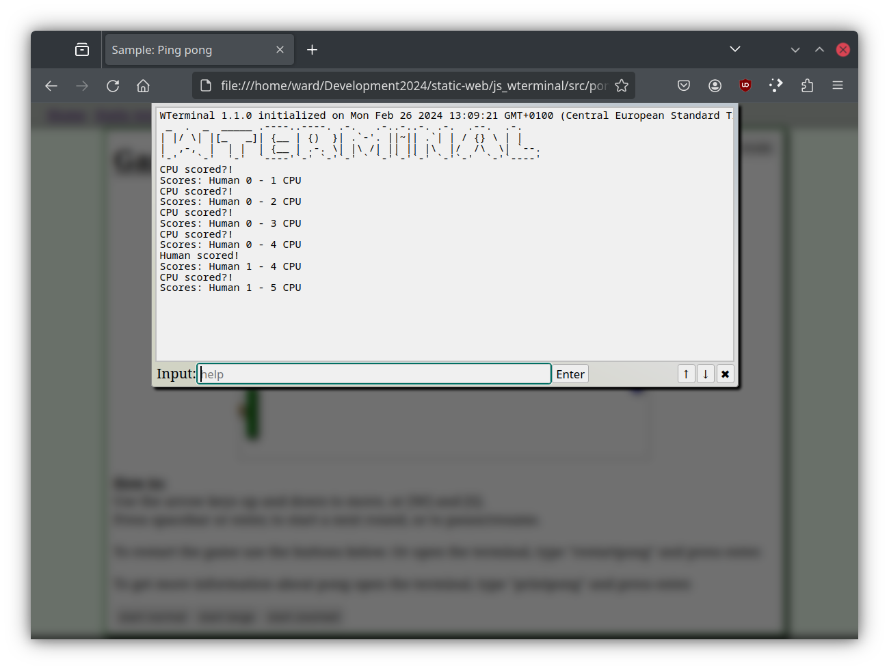
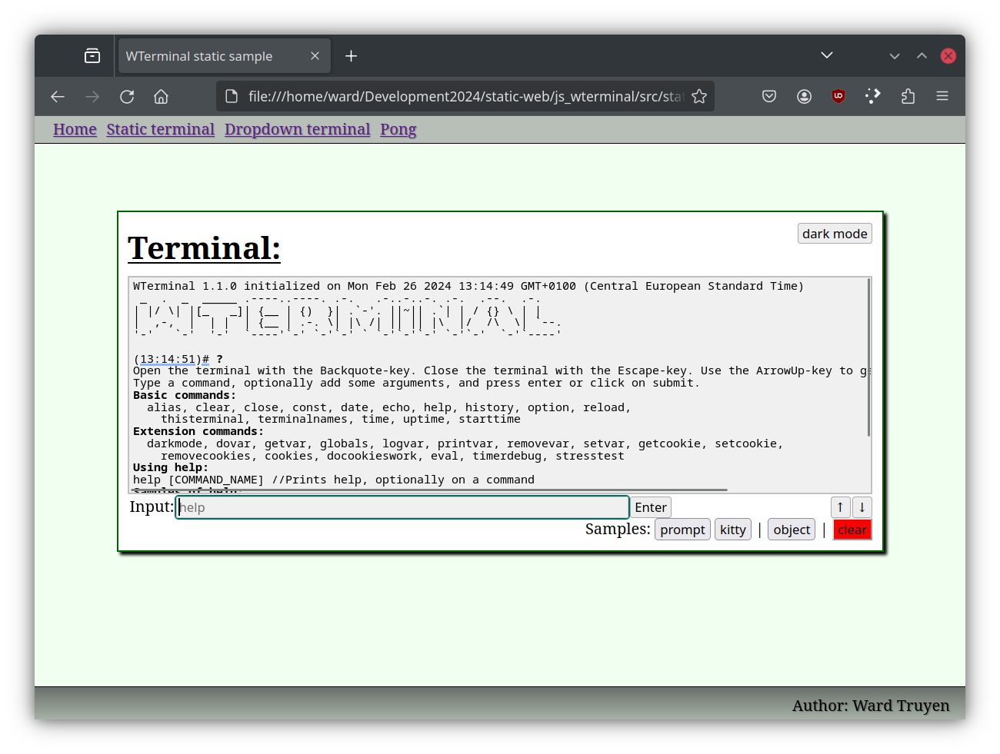

```
*  _  .  _  _____ .----..----. .-.   .-..-..-. .-.  .--.  .-.   
* | |/ \| |[_   _]| {__ | {)  }| .`-'. ||~|| .`| | / {} \ | |   
* |  ,-,  |  | |  | {__ | .-. \| |\ /| || || |\  |/  /\  \| `--.
* '-'   `-'  '-'  `----'`-' `-'`-' ` `-'`-'`-' `-'`-'  `-'`----'
```

# For terminal fun on the web.

## About

Can be used as a dropdown terminal and as a normal (static) terminal, at the same time.
It provides easy tools for printing and changing public variables(javascript) and cookies.
Can be useful for testing/logging-debugging without opening the console every time.
Can be extended without changing the terminal.js code.

## Screenshots

Terminal as a dropdown



Terminal static



## Terminal as WebExtension

You can also use this terminal-project as a browser-extension. Get a terminal everywhere you surf.

Howto: 

- [MDN WebExtension](https://developer.mozilla.org/en-US/diocs/Mozilla/Add-ons/WebExtensions/Your_first_WebExtension)
- [firefox about:debugging](https://firefox-source-docs.mozilla.org/devtools-user/about_colon_debugging/index.html)
